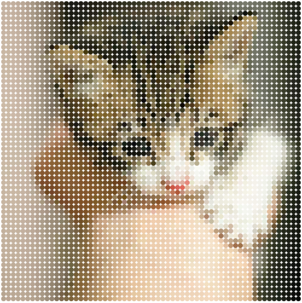

Photo mosaic
------------

1. Select a local image file.
2. The app loads that image, divides the image into tiles, computes the average
   color of each tile, creates a svg tile of that color, and
   composites the results into a photomosaic of the original image.

Have fun!

[Live Demo](https://vivekimsit.github.io/mosaic.js/)

Sample
------------

